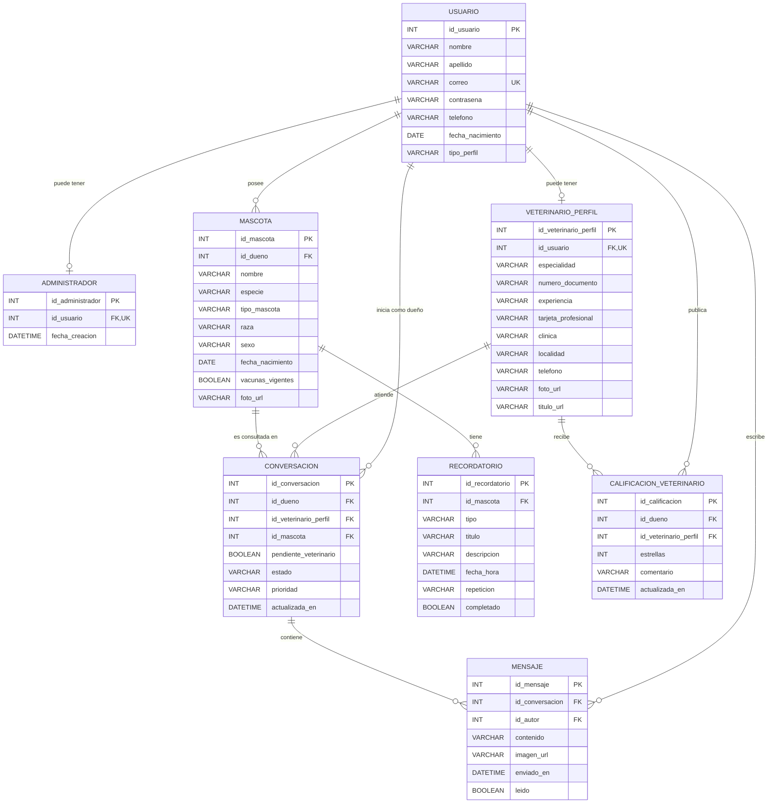

# Modelo relacional de Zoi

## Reglas principales

- `usuario.correo` es único.
- Un usuario solo puede tener un perfil administrador y un perfil veterinario.
- Una conversación es única para la combinación dueño, veterinario y mascota.
- Un dueño solo puede calificar una vez a cada veterinario.
- Las estrellas deben estar entre 1 y 5.
- Todas las tablas dependientes cuentan con claves foráneas e índices para sus búsquedas frecuentes.
- Las eliminaciones de entidades principales se propagan mediante `ON DELETE CASCADE`, evitando registros huérfanos.
- Hibernate usa `ddl-auto=validate`; el esquema solo cambia mediante migraciones revisadas.
